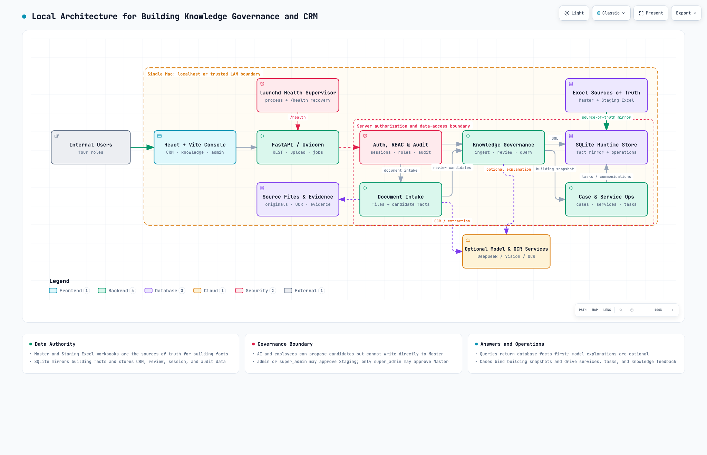
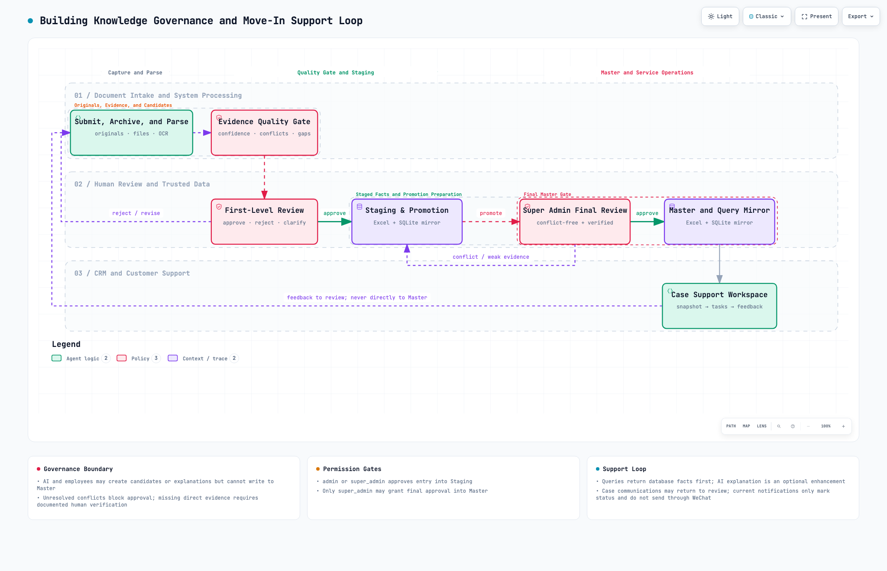

# Welcome Letter Building Knowledge Governance System

A local, human-governed knowledge system that turns building onboarding documents into reviewable structured facts and connects those facts to customer-service Cases.

This repository is a sanitized English capstone copy of an existing internal prototype. It is intended for university software-engineering teams interested in extending the prototype with locally run, open-source or open-weight Chinese models.

The source retains the internal `Whitepaper` codename and `WHITEPAPER_` environment-variable prefix for compatibility.

The system is **not** an autonomous WeChat bot, a public SaaS product, or an unattended ordering agent.

## Start Here

- [Capstone project proposal](docs/CAPSTONE_PROJECT_PROPOSAL.md)
- [Interactive system architecture](whitepaper-system-architecture.html)
- [System architecture source](whitepaper-system-architecture.archify.json)
- [Interactive business workflow](whitepaper-business-workflow.html)
- [Business workflow source](whitepaper-business-workflow.archify.json)
- [Synthetic Welcome Letter fixtures](test_data/welcome_letters/README.md)
- [Security and privacy notes](SECURITY_AND_PRIVACY.md)
- [macOS install help](MAC_INSTALL_HELP.txt)

## Diagram Previews

## Problem and Approach

Apartment-building Welcome Letters contain reusable facts such as property contacts, move-in requirements, Certificate of Insurance instructions, renter's insurance requirements, electricity setup, and internet-provider information.

The prototype converts these documents into candidate fields, preserves supporting evidence, and sends all proposed changes through a human review process. Approved building facts can then be associated with a customer Case so staff can answer routine questions without repeatedly searching historical PDFs.

The central design rule is:

> AI extracts, compares, and recommends; software controls permissions and state; people approve official changes and consequential external actions.

## Current Prototype vs. Proposed Capstone Work

| Capability | Status |
| --- | --- |
| Local FastAPI, React/Vite, SQLite application | Implemented |
| Excel-backed Master and Staging stores with SQLite mirrors | Implemented |
| Manual text, PDF, and image Welcome Letter intake | Implemented |
| OCR routing and evidence-bearing candidate fields | Implemented |
| Human review, conflict flags, approval, rejection, and audit logs | Implemented |
| Admin-to-Staging and Super Admin-to-Master governance | Implemented |
| Building records, CRM Cases, guests, services, tasks, and communication events | Implemented |
| Optional AI parsing and explanations through a configurable OpenAI-compatible endpoint | Implemented |
| Separately hosted local Unlimited-OCR endpoint | Supported but optional |
| Automatic monitored-inbox email ingestion | **Not implemented; proposed MVP work** |
| Fully local open-weight language-model workflow for the core AI path | **Not implemented; proposed MVP work** |
| Versioned building-summary cache | **Not implemented; proposed MVP work** |
| Browser Agent for provider research | **Not implemented; optional extension** |
| Browser Agent order prefilling with a human confirmation stop | **Not implemented; stretch goal** |
| Direct WeChat bot integration or autonomous replies | **Out of scope** |
| Unattended order submission, payment, or contract acceptance | **Out of scope** |

The CRM notification endpoints currently manage draft, approval, and sent-state records inside the application. They do not send messages through WeChat or another external messaging connector.

## Core Governance Rules

### Sources of Truth

- **building_knowledge_master.xlsx** is the formal Master Excel source.
- **building_knowledge_staging.xlsx** is the Staging Excel source.
- SQLite mirrors both workbooks for querying, workflow state, permissions, and audit history.
- Application data must be read or changed through the backend API.

The default files are stored under **backend/data/master_excel/** after initialization.

### Review Boundaries

- Parsed Excel, PDF, image, text, and chat-derived values are candidates, not facts.
- AI cannot write directly to Master.
- Employees cannot write directly to Master.
- Admin or Super Admin users review candidates before they enter Staging.
- Only a Super Admin can approve promotion into Master.
- Master changes retain review and audit information.
- Customer-facing assistance should use approved Master facts. Staging may be viewed separately, but it must not silently become an official answer source.

### Unknown Values

Blank values and markers such as “unknown,” “N/A,” or “to be confirmed” are normalized as unknown.

An unknown value is not equivalent to false. For example, “insurance requirement unknown” must not be interpreted as “insurance is not required.”

### Human Customer Support

The intended operational path is:

> Customer asks in WeChat → employee opens the linked Case → system retrieves approved Building facts → system may prepare a draft → employee verifies and replies manually

## Technology

| Layer | Current implementation |
| --- | --- |
| Frontend | React 18, Vite 5, Tailwind CSS |
| Backend | Python 3.9+, FastAPI, Uvicorn |
| Data | Excel truth sources, SQLite mirrors |
| Document processing | PyMuPDF, PyPDF2, OpenPyXL, local OCR routing |
| Optional AI | OpenAI-compatible API configured through the DEEPSEEK variables |
| Optional vision | Configurable OpenAI-compatible vision endpoint |
| Optional local OCR | Baidu Unlimited-OCR served separately through a vLLM-compatible HTTP endpoint |
| Operations | macOS command launchers and optional launchd health recovery |

The current application can run without a DeepSeek API key. AI parsing or explanation features that require a configured model endpoint will be unavailable or degraded, while deterministic data and review workflows remain usable.

## Quick Start on macOS

### Prerequisites

- Python 3.9 or newer
- Node.js 18 or newer for a source checkout; packaged releases may include a prebuilt **frontend/dist/**
- npm

The installer can use Homebrew to install Python when Homebrew is available.

### Recommended Setup

From the repository root:

~~~bash
./install.command --no-start
./start.command
~~~

The installer creates **backend/.venv**, installs backend dependencies, builds the frontend when necessary, creates **backend/.env.local**, and offers to configure optional model endpoints.

The launcher asks for:

1. **Daemon mode** or **development mode**
2. **Local-only access** or **LAN access**

Daemon mode is recommended for a long-running local installation. It serves the built frontend through FastAPI. Development mode runs Uvicorn with reload and starts the Vite development server.

Default addresses are:

- Application in daemon mode: http://127.0.0.1:8000
- Frontend in development mode: http://127.0.0.1:5173
- Backend API in development mode: http://127.0.0.1:8000
- Health endpoint: http://127.0.0.1:8000/health
- FastAPI documentation: http://127.0.0.1:8000/docs

If a default port is occupied, **start.command** scans for the next available port and prints the selected address.

### Manual Development Setup

Backend:

~~~bash
cd backend
python3 -m venv .venv
.venv/bin/python -m pip install -r requirements.txt
.venv/bin/python -m uvicorn main:app --reload --host 127.0.0.1 --port 8000
~~~

Frontend, in a second terminal:

~~~bash
cd frontend
npm install
VITE_API_BASE=http://127.0.0.1:8000 npm run dev -- --host 127.0.0.1 --port 5173
~~~

## Initial Local Accounts

The database creates four role-specific accounts during first-time initialization:

| Username | Role |
| --- | --- |
| superadmin | Super Admin |
| admin | Admin |
| employee | Employee |
| viewer | Viewer |

The installer requires the operator to set initial passwords locally. Do not place those passwords in source control, screenshots, shared packages, or classroom fixtures.

Initial passwords may be supplied through the **WHITEPAPER_SUPERADMIN_PASSWORD**, **WHITEPAPER_ADMIN_PASSWORD**, **WHITEPAPER_EMPLOYEE_PASSWORD**, and **WHITEPAPER_VIEWER_PASSWORD** environment variables before the database is created.

## Configuration

Use [backend/.env.local.example](backend/.env.local.example) as the local configuration template. Real credentials belong in **backend/.env.local** and should not be committed or included in a release package.

Important settings include:

| Variable | Purpose |
| --- | --- |
| DEEPSEEK_API_KEY | Optional key for AI parsing and explanations |
| DEEPSEEK_MODEL | Model name for the configured OpenAI-compatible endpoint |
| DEEPSEEK_BASE_URL | Base URL for that endpoint |
| VISION_API_KEY, VISION_MODEL, VISION_BASE_URL | Optional scanned-document vision review |
| OCR_PROVIDER | Primary OCR provider; defaults to local |
| OCR_FALLBACK_PROVIDER | OCR provider used after a primary failure |
| UNLIMITED_OCR_LOCAL_BASE_URL | Optional separately hosted Unlimited-OCR service |
| UNLIMITED_OCR_LOCAL_MODEL | Defaults to baidu/Unlimited-OCR |
| WHITEPAPER_DB_PATH | SQLite mirror and workflow database |
| WHITEPAPER_UPLOAD_DIR | Uploaded source-document directory |
| WHITEPAPER_MASTER_XLSX_PATH | Formal Master workbook |
| WHITEPAPER_STAGING_XLSX_PATH | Staging workbook |
| CORS_ALLOW_ORIGINS | Allowed frontend origins |

The DEEPSEEK variable names are retained for compatibility. The implementation uses an OpenAI-compatible client, so a compatible local endpoint can be evaluated without changing every call site. Completing and validating a fully local language-model path is part of the proposed capstone work.

## Main Workflows

### Welcome Letter Intake

The existing prototype supports:

- Plain text or email-body text pasted manually
- PDF upload
- Image upload

The parser extracts only information explicitly supported by the source. It does not invent internet packages, prices, speeds, or providers. Results enter the review queue.

Automatic retrieval from a monitored email inbox is not present.

### Excel Import

> Administrator uploads an Excel workbook 
> → system proposes header mappings 
> → administrator confirms, ignores, or creates fields 
> → valid cells become Staging update requests 
> → authorized reviewers decide whether they may progress

### Master and Staging Mirrors

At startup, the formal and Staging Excel workbooks rebuild their corresponding SQLite mirrors.

- Saving a Master record writes the Master workbook and refreshes the relevant mirrors.
- Saving a Staging record writes the Staging workbook and refreshes its mirror.
- Promoting a Staging building to Master does not delete the Staging row; its status is updated.

### Case-Based Assistance

CRM Cases can be associated with a building and may include customers or guests, services, tasks, progress, and communication events. The Case can use the associated building snapshot and approved facts to support staff.

The system does not read WeChat messages automatically. Communication material must be entered by a person or through a future authorized integration.

## Repository Structure

~~~text
whitepaper-english-capstone/
├── backend/
│   ├── app_main.py                 FastAPI application and API routes
│   ├── main.py                     Uvicorn entry point
│   ├── kb_db.py                    SQLite schema, seed data, and runtime paths
│   ├── kb_master_excel.py          workbook validation and atomic synchronization
│   ├── kb_security.py              password and session security
│   ├── kb_unknowns.py              unknown-value normalization
│   ├── ocr_services.py             OCR providers and fallback routing
│   ├── legacy_demo.py              retained legacy import/reference logic
│   ├── tests/                      backend unit tests
│   └── data/                       generated database, uploads, workbooks, and logs
├── frontend/
│   ├── src/                        React application
│   └── package.json                frontend scripts and dependencies
├── docs/
│   ├── CAPSTONE_PROJECT_PROPOSAL.md
│   └── previews/                    architecture and workflow PNG previews
├── ops/launchd/                    macOS launchd template
├── scripts/
│   ├── install_launchd.command
│   └── whitepaper_daemon.zsh
├── test_data/
│   └── welcome_letters/            explicitly synthetic extraction and conflict fixtures
├── install.command                 dependency and local-configuration installer
├── start.command                   interactive local launcher
├── package.command                 release-package builder
├── SECURITY_AND_PRIVACY.md         shareable-copy handling rules
├── MAC_INSTALL_HELP.txt            macOS quarantine help
├── whitepaper-system-architecture.archify.json
└── whitepaper-business-workflow.archify.json
~~~

## Testing and Validation

Run backend unit tests after installation:

~~~bash
cd backend
.venv/bin/python -m unittest discover -s tests -v
~~~

The current tests cover business-rule helpers, privacy filtering for chat-derived candidates, workbook recovery behavior, OCR fallback behavior, Baidu asynchronous OCR handling, and the local Unlimited-OCR request format.

There is no frontend unit-test command in the current **frontend/package.json**. Use a production build as the current frontend validation:

~~~bash
cd frontend
npm run build
~~~

With the application running, verify health:

~~~bash
curl -fsS http://127.0.0.1:8000/health
~~~

For a capstone submission, the test suite should be expanded to cover API authorization, Master/Staging transitions, deduplication, evidence traceability, Case-to-Building retrieval, cache invalidation, local-model evaluation, and browser-agent safety stops.

## Sample Data

The shareable English copy intentionally contains no real Welcome Letters, customer records, building-contact lists, OCR reports, uploads, or databases.

The **test_data/welcome_letters/** directory contains two clearly labeled, fully fictional Welcome Letters in Markdown and PDF form. Import the January fixture first and the June update second to exercise structured extraction, evidence capture, unchanged-field handling, conflict detection, and human approval.

Additional fixtures must be synthetic or explicitly sanitized. Historical material can be imported only in an approved private environment through the application or **POST /bootstrap/legacy**; it must not be copied into a classroom repository without authorization.

## Selected API Areas

The complete route list is available from FastAPI at **/docs** while the backend is running.

- Authentication: **/auth/**
- User administration: **/admin/users**
- Dashboard: **/dashboard/overview**
- CRM Cases, services, tasks, and communications: **/crm/**
- Field definitions and requests: **/fields**, **/field-requests/**
- Master workbook and mirrors: **/master-excel/**, **/excel-mirrors/refresh**
- Excel import: **/imports/excel/**
- Welcome Letter and chat intake: **/intake/**
- Review queue: **/review/groups/**
- Staging buildings: **/staging/buildings/**
- Master buildings: **/master/buildings/**
- Structured answers and optional explanations: **/query/**
- Audit events: **/audit-logs**
- Health: **/health**, **/admin/health**

## Long-Running Local Operation

For a trusted LAN installation on macOS:

1. Start locally and change all default passwords.
2. Run **start.command** and select daemon mode.
3. Select LAN access only on a trusted network.
4. Install the optional launchd job:

~~~bash
scripts/install_launchd.command
~~~

The daemon checks **/health**, restarts a failed backend, and records runtime status under **backend/data/**.

No public tunnel is configured. Tunnel-related environment variables are reserved for future work.

## Packaging

Run:

~~~bash
./package.command
~~~

The package builder creates a release directory and attempts to create ZIP and DMG artifacts. The packaged frontend does not require Node.js on the target machine, but the current release still requires Python 3.9 or newer.

The English package builder excludes runtime databases, uploads, source-document libraries, generated workbooks, API keys, logs, and local status. Review every derived package before sharing it with students or third parties.

## Current Limitations

- The application is designed as a local internal tool, not a hardened public service.
- There is no external SSO.
- There is no automatic monitored-inbox ingestion.
- There is no WeChat API integration.
- “Send notification” currently updates internal state; it does not deliver an external message.
- There is no browser Agent in this repository.
- There is no unattended provider ordering, payment, or signing.
- AI extraction and explanations may use a configured external OpenAI-compatible endpoint.
- The local Unlimited-OCR option requires a separately deployed NVIDIA GPU service.
- A fully local, evaluated open-weight language-model workflow remains capstone work.
- The release does not bundle a Python runtime.

## License and Data Handling

This repository is publicly viewable for capstone evaluation and technical discussion, but no software license is granted. Viewing or cloning the repository does not grant permission to reuse, redistribute, or adapt it. Contact the sponsor before beginning implementation so collaboration and licensing terms can be agreed in writing.

Do not distribute real customer documents, contact details, credentials, building access information, or production databases. Use sanitized or synthetic documents for classroom work and demonstrations.
